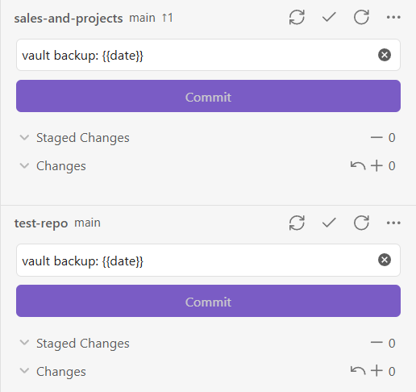

# Obsidian Git Plugin

A powerful community plugin for [Obsidian.md](https://obsidian.md) that brings Git integration right into your vault. Automatically commit, pull, push, and see your changes — all within Obsidian.

## 📚 Documentation

## Key Features

- 🔁 **Automatic commit-and-sync** (commit, pull, and push) on a schedule.
- 📥 **Auto-pull on Obsidian startup**
- 📂 **Submodule support** for managing multiple repositories (desktop only and opt-in)
- 🔧 **Source Control View** to stage/unstage, commit and diff files - Open it with the `Open source control view` command.
- 📜 **History View** for browsing commit logs and changed files - Open it with the `Open history view` command.
- 🔍 **Diff View** for viewing changes in a file - Open it with the `Open diff view` command.
- 📝 **Signs in the editor** to indicate added, modified, and deleted lines/hunks (desktop only).
- GitHub integration to open files and history in your browser

## UI Previews

### 🔧 Source Control View

Manage your file changes directly inside Obsidian like stage/unstage individual files and commit them.

Open it from the left sidebar by clicking the source control icon, or via the `Open source control view` command.

### 📜 History View

Show the commit history of your repository. The commit message, author, date, and changed files can be shown. Author and date are disabled by default as shown in the screenshot, but can be enabled in the settings.

### 🔍 Diff View 

Compare versions with a clear and concise diff viewer.
Open it from the source control view or via the `Open diff view` command.

## Available Commands
> Not exhaustive - these are just some of the most common commands. For a full list, see the Command Palette in Obsidian.

- 🔄 Changes
  - `List changed files`: Lists all changes in a modal
  - `Open diff view`: Open diff view for the current file
  - `Stage current file`
  - `Unstage current file`
  - `Discard all changes`: Discard all changes in the repository
- ✅ Commit
  - `Commit`: If files are staged only commits those, otherwise commits only files that have been staged
  - `Commit with specific message`: Same as above, but with a custom message
  - `Commit all changes`: Commits all changes without pushing
  - `Commit all changes with specific message`: Same as above, but with a custom message
- 🔀 Commit-and-sync
  - `Commit-and-sync`: With default settings, this will commit all changes, pull, and push
  - `Commit-and-sync with specific message`: Same as above, but with a custom message
  - `Commit-and-sync and close`: Same as `Commit-and-sync`, but if running on desktop, will close the Obsidian window. Will not exit Obsidian app on mobile.
- 🌐 Remote
  - `Push`, `Pull`
  - `Edit remotes`: Add new remotes or edit existing remotes
  - `Remove remote`
  - `Clone an existing remote repo`: Opens dialog that will prompt for URL and authentication to clone a remote repo
  - `Open file on GitHub`: Open the file view of the current file on GitHub in a browser window. Note: only works on desktop
  - `Open file history on GitHub`: Open the file history of the current file on GitHub in a browser window. Note: only works on desktop
- 🏠 Manage local repository
  - `Initialize a new repo`
  - `Create new branch`
  - `Delete branch`
  - `CAUTION: Delete repository`
- 🧪 Miscellaneous
  - `Open source control view`: Opens side pane displaying [Source control view](#sidebar-view)
  - `Open history view`: Opens side pane displaying [History view](#history-view)
  - `Edit .gitignore`
  - `Add file to .gitignore`: Add current file to `.gitignore`
